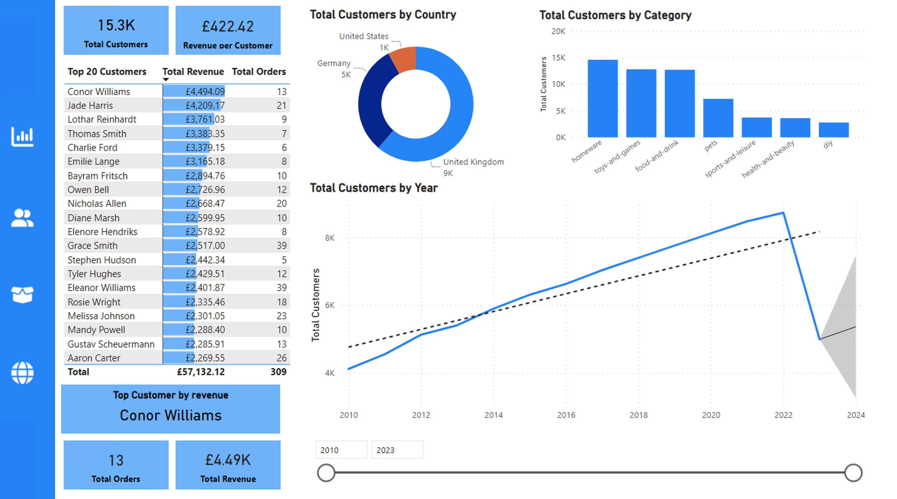

# Data Analytics Power BI Report

## Project Description
You have recently been approached by a medium-sized international retailer who is keen on elevating their business intelligence practices. With operations spanning across different regions, they've accumulated large amounts of sales from disparate sources over the years.

This was the final project as part of the AI Core Data Analyst pathway where using the brief mentioned previously, a Power BI report had to be produced and also utilising SQL queries to discover more about the underlying data.

## Installation instructions
1. **Clone this repository**: Clone this repository onto your local machine to get the necessary files and tools to get started.
2. **Ensure tools and libraries are installed**: My local machine was a Macbook thus I had to use Azure and its VM to open and edit the .pbix file. Additional SQL queries were written and compile using VSCode

## Milestones
The following shows the milestones that were followed when completing the project.

- **Milestone 1**: Setting up the environment
    - Created a new GitHub repository, then cloned onto local machine
    - Installed necessary tools and ensure the Azure VM was working as expected to start making developments

- **Milestone 2**: Import the Data into Power BI
    - `Orders` table: Imported using Azure SQL Database
    - `Products` table: Imported using the **Get Data** function in Power BI, uploaded via .CSV file
    - `Stores` table: Imported using the Azure Blob Storage and import the table onto the project
    - `Customers` table: Imported using the **Get Data** function in Power BI, uploaded via .CSV file
    - After importing each of the data tables, some additional methods needed to be carried out in order to ensure that the data was inline with what the task was outlined to achieve. For example, certain columns of data were removed as they contained sensitive information and were not relevant, certain columns were split into different columns as they could be split and some were combined together for example first names and seconds names into a single full name column.

- **Milestone 3**: Create the Data Model
    - `Date` table: Using DAX formulas, a date table was created using preexisting data from other tables
    - A **Star Schema Data Model** was also created to visualise and create relationships between the different tables, ensuring all relationships were **one-to-many** with a single filter directions.
    - **Measure tables** were also created which included key measures for data points which were to be used later down for creating visualisations.
    - **Hierarchies** were created to be used later for visualisations.

- **Milestone 4**: Set up the report
    - Four report pages were created as follows:
    - `Executive Summary`, `Customer Detail`, `Product Detail`,`Stores Map`

- **Milestone 5**: Customer Detail Page

- **Milestone 6**: Executive Summary Page

- **Milestone 7**: Product Detail Page

- **Milestone 8**: Stores Map Page

- **Milestone 9**: Cross-Filtering and Navigation
    - Final details were added to report to remove any cross-highlighting as we didn't want all areas of the report to change after filters were applied
    - The Navigation bar was polished by adding buttons which directed users to different pages of reports

- **Milestone 10**: Metrics for users outside of the company using SQL
    - Using a Postgres Database server, we could see the tables within the database and then converted the names of columns for each tables in the database into its respective .CSV file
    - Following queries were executed to get some insights of the database using SQL:
        1. How many staff are there in all of the UK stores?
        2. Which month in 2022 has had the highest revenue?
        3. Which German store type had the highest revenue for 2022?
        4. Create a view where the rows are the store types and the columns are the total sales, percentage of total sales and the count of orders
        5. Which product category generated the most profit for the "Wiltshire, UK" region in 2021?

## File structure
- **`AICore_Data_Analyst_report.pbix`**: The main Power BI report file including all pages: `Executive Summary`, `Customer Detail`, `Product Detail`and `Stores Map`
- **`orders_db columns`**: A folder containing all .CSV files of column names of each table in the `orders-db` database
- **`SQL Questions`**: A folder containing all the queries and resulting .CSV files of the questions mentioned in Milestone 10 
